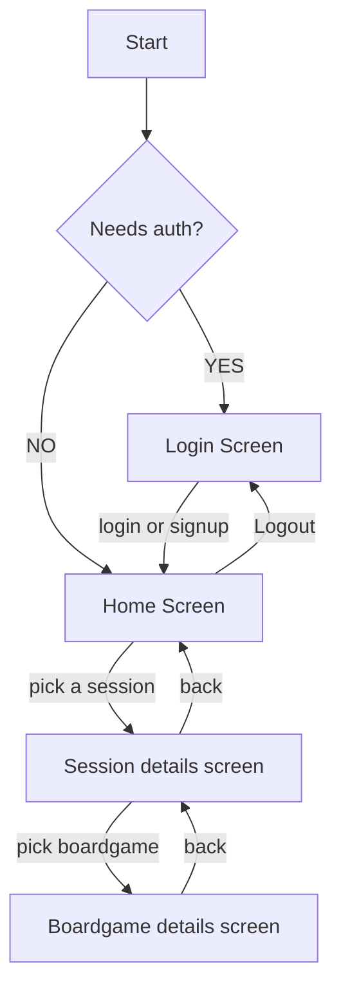

```mermaid
flowchart TD
    A[Start] --> C{Needs auth?}
    C --> |YES| D[Login Screen]
    C --> |NO| E[Home Screen]
    E --> |Logout| D
    D --> |login or signup| E
    E --> |pick a session| F[Session details screen]
    F --> |back| E
    F --> |pick boardgame| G[Boardgame details screen]
    G --> |back| F
    %% B --> C{Let me think}
    %% C -->|One| D[Laptop]
    %% C -->|Two| E[iPhone]
    %% C -->|Three| F[fa:fa-car Car]
```
