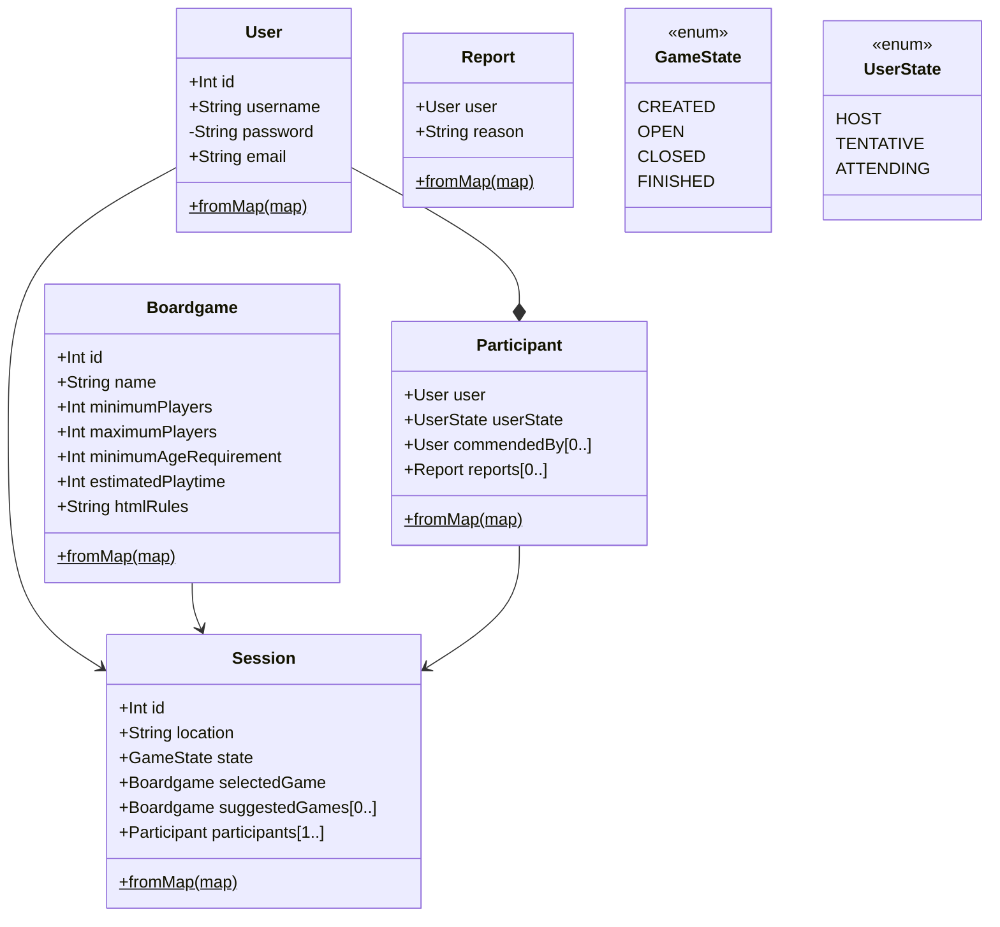

should we have everything? UI classes, Repositories, Utils?

```mermaid
classDiagram
    class User{
      +Int id
      +String username
      -String password
      +String email
      +fromMap(map)$
    }
    class Boardgame {
      +Int id
      +String name
      +Int minimumPlayers
      +Int maximumPlayers
      +Int minimumAgeRequirement
      +Int estimatedPlaytime
      +String htmlRules
      +fromMap(map)$
    }

    class Session {
      +Int id
      +String location
      +GameState state
      +Boardgame selectedGame
      +Boardgame suggestedGames[0..]
      +Participant participants[1..]
      +fromMap(map)$
    }

    class Participant {
        +User user
        +UserState userState
        +User commendedBy[0..]
        +Report reports[0..]
        +fromMap(map)$
    }

    User --* Participant
    User --> Session
    Boardgame --> Session
    Participant --> Session


    class Report {
        +User user
        +String reason
        +fromMap(map)$
    }

    class GameState {
        CREATED
        OPEN
        CLOSED
        FINISHED
    }

    class UserState {
        HOST
        TENTATIVE
        ATTENDING
    }
    <<enum>> UserState
    <<enum>> GameState
```