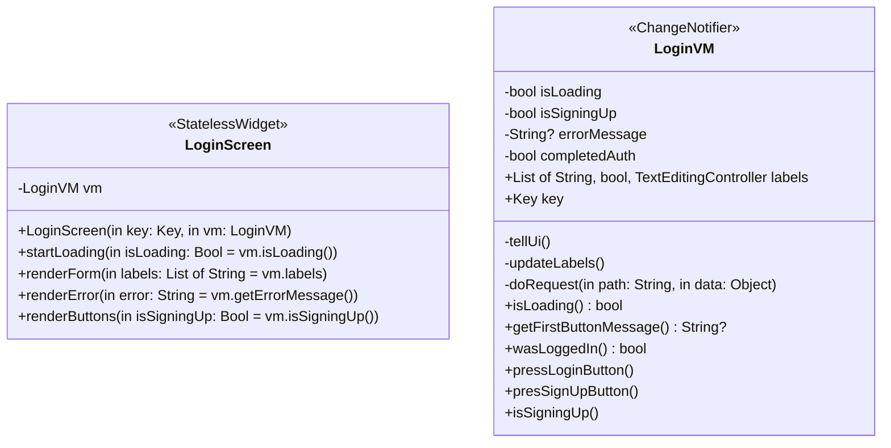

```mermaid
classDiagram
    class LoginScreen{
      -LoginVM vm
      +LoginScreen(in key: Key, in vm: LoginVM)
      +startLoading(in isLoading: Bool = vm.isLoading())
      +renderForm(in labels: List of String = vm.labels)
      +renderError(in error: String = vm.getErrorMessage())
      +renderButtons(in isSigningUp: Bool = vm.isSigningUp())
    }

    class LoginVM{
      -bool isLoading
      -bool isSigningUp
      -String? errorMessage
      -bool completedAuth
      +List of String, bool, TextEditingController labels
      +Key key
      -tellUi()
      -updateLabels()
      -doRequest(in path: String, in data: Object)
      +isLoading() bool
      +getFirstButtonMessage() String?
      +wasLoggedIn() bool
      +pressLoginButton()
      +presSignUpButton()
      +isSigningUp()
      


    }

    <<StatelessWidget>> LoginScreen
    <<ChangeNotifier>> LoginVM
```