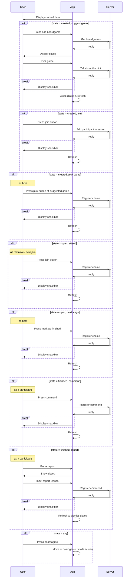

```mermaid
sequenceDiagram
    participant User
    participant App
    App->>User: Display cached data
    alt state = created, suggest game
        User->>App: Press add boardgame
        App->>+Server: Get boardgames
        Server->>-App: reply
        App->>User: Display dialog
        User->>App: Pick game
        App->>+Server: Tell about the pick
        Server->>-App: reply
        break
            App->>User: Display snackbar
        end
        App->>App: Close dialog & refresh
    end
    alt state = created, join
        User->>App: Press join button
        App->>+Server: Add participant to sesion
        Server->>-App: reply
        break
            App->>User: Display snackbar
        end
        App->>App: Refresh
    end
    alt state = created, pick game
        Note over User: as host
        User->>App: Press pick button of suggested game
        App->>+Server: Register choice
        Server->>-App: reply
        break
            App->>User: Display snackbar
        end
        App->>App: Refresh
    end
    alt state = open, attend
        Note over User: as tentative / new join
        User->>App: Press join button
        App->>+Server: Register choice
        Server->>-App: reply
        break
            App->>User: Display snackbar
        end
        App->>App: Refresh
    end
    alt state = open, next stage
        Note over User: as host
        User->>App: Press mark as finished
        App->>+Server: Register choice
        Server->>-App: reply
        break
            App->>User: Display snackbar
        end
        App->>App: Refresh
    end
    alt state = finished, commend
        Note over User: as a participant
        User->>App: Press commend 
        App->>+Server: Register commend
        Server->>-App: reply
        break
            App->>User: Display snackbar
        end
        App->>App: Refresh
    end
    alt state = finished, report
        Note over User: as a participant
        User->>App: Press report
        App->>User: Show dialog
        User->>App: Input report reason 
        App->>+Server: Register commend
        Server->>-App: reply
        break
            App->>User: Display snackbar
        end
        App->>App: Refresh & dismiss dialog
    end
    alt state = any
        User->>App: Press boardagme
        App->>App: Move to boardgame details screen
    end
```