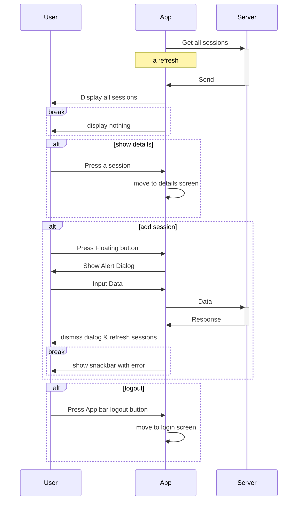

```mermaid
sequenceDiagram
    participant User
    App->>+Server: Get all sessions
    Note over App: a refresh
    Server->>-App: Send
    App->>User: Display all sessions
    break
        App->>User: display nothing
    end
    alt show details
        User->>App: Press a session
        App->>App: move to details screen
    end
    alt add session
        User->>App: Press Floating button
        App->>User: Show Alert Dialog
        User->>App: Input Data
        App->>+Server: Data
        Server->>-App: Response
        App->>User: dismiss dialog & refresh sessions
        break
            App->>User: show snackbar with error
        end
    end
    alt logout
        User->>App: Press App bar logout button
        App->>App: move to login screen
    end
```