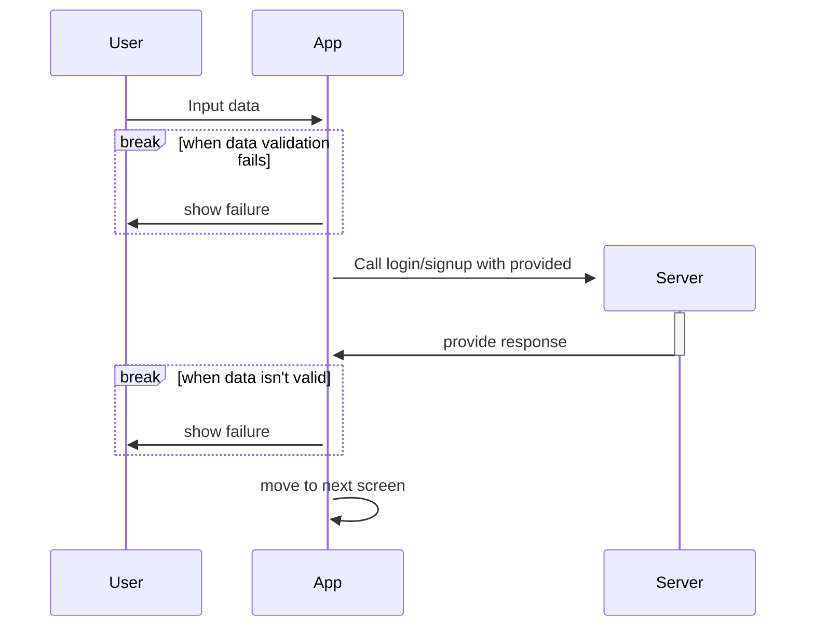

```mermaid
sequenceDiagram
    User->>+App: Input data
    break when data validation fails
        App->>User: show failure
    end
    create participant Server
    App->>+Server: Call login/signup with provided 
    Server->>-App: provide response
    break when data isn't valid
        App->>User: show failure
    end
    App->>App: move to next screen
    
```